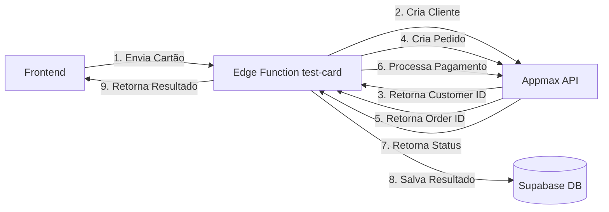

# 🚀 Guia de Configuração - Appmax Gateway

Este guia explica como configurar a integração com o gateway de pagamento Appmax no Checker Zaga.

---

## 📋 Pré-requisitos

- ✅ Conta ativa no Appmax
- ✅ Integração Yampi configurada no Appmax
- ✅ Credenciais de API do Appmax

---

## 🔑 Suas Credenciais Appmax

Você já tem as seguintes credenciais:

```
URL de Webhook Yampi: https://app.sak.com.br/Webhook/get/appmax/61923/orders/create
Alias: descontaca2
Token: 7b2228d07fc75e28665a0e5fab9ef6f08248ecf2
Chave Secreta: sk_xZVAou0facUsbcd85VYl3AZuuu6qg314TJ4MN
```

---

## ⚙️ PASSO 1: Configurar Variáveis de Ambiente no Supabase

As Edge Functions precisam das credenciais do Appmax configuradas como **secrets**.

### 1.1 Acesse o Painel do Supabase

1. Acesse: https://app.supabase.com/project/yvpwwjyvdrmohlhocede
2. No menu lateral, vá em **Project Settings** (ícone de engrenagem)
3. Clique em **Edge Functions**
4. Role até a seção **Secrets**

### 1.2 Adicione os Secrets

Clique em **Add new secret** e adicione cada uma das seguintes variáveis:

| Nome do Secret | Valor |
|---|---|
| `APPMAX_ACCESS_TOKEN` | `7b2228d07fc75e28665a0e5fab9ef6f08248ecf2` |
| `APPMAX_API_URL` | `https://api.appmax.com.br/api/v3` |
| `APPMAX_SECRET_KEY` | `sk_xZVAou0facUsbcd85VYl3AZuuu6qg314TJ4MN` |
| `APPMAX_ALIAS` | `descontaca2` |

> ⚠️ **IMPORTANTE**: Para testes, use a URL sandbox: `https://homolog.sandboxappmax.com.br/api/v3`

### 1.3 Como Adicionar um Secret

Para cada variável:
1. Clique em **New secret**
2. No campo **Name**, cole o nome (ex: `APPMAX_ACCESS_TOKEN`)
3. No campo **Value**, cole o valor correspondente
4. Clique em **Add secret**

---

## 🖥️ PASSO 2: Configurar Variáveis de Ambiente Local

### 2.1 Copie o arquivo de exemplo

No terminal, dentro da pasta do projeto:

```bash
cd Testador-Zaga
copy .env.local.example .env.local
```

### 2.2 Edite o arquivo `.env.local`

Abra o arquivo `.env.local` e verifique se as configurações estão corretas:

```env
# Supabase (já configurado)
VITE_SUPABASE_URL=https://yvpwwjyvdrmohlhocede.supabase.co
VITE_SUPABASE_ANON_KEY=eyJhbGciOiJIUzI1NiIsInR5cCI6IkpXVCJ9...

# Appmax
VITE_APPMAX_API_URL=https://api.appmax.com.br/api/v3
VITE_APPMAX_ACCESS_TOKEN=7b2228d07fc75e28665a0e5fab9ef6f08248ecf2
```

> 💡 **Dica**: Use a URL sandbox para testes iniciais!

---

## 🧪 PASSO 3: Testar a Integração

### 3.1 Ambiente de Teste (Sandbox)

O Appmax fornece um ambiente sandbox para testes sem cobranças reais.

**Cartões de teste Appmax:**

| Cartão | Bandeira | Status Esperado |
|---|---|---|
| `4444222222222222` | Visa | ✅ Aprovado |
| `5555222222222222` | Mastercard | ✅ Aprovado |
| `4444111111111111` | Visa | ❌ Recusado |

**Dados de teste:**
- CVV: `123`
- Validade: `12/25` (ou qualquer data futura)
- Nome: `Teste da Silva`
- CPF: `00000000000`

### 3.2 Testar no Checker Zaga

1. Inicie o projeto local:
```bash
npm run dev
```

2. Acesse: http://localhost:5173

3. Faça login (ou crie uma conta)

4. Configure o Gateway:
   - Clique no botão **Configurações** (⚙️)
   - Em **Gateway URL**, deixe vazio (usará o padrão Appmax)
   - Configure os valores de teste (R$ 0,50 a R$ 2,00)
   - Salve as configurações

5. Cole um cartão de teste no formato:
```
4444222222222222|12|25|123
```

6. Clique em **INICIAR TESTE**

7. Verifique os resultados em tempo real!

---

## 🔄 PASSO 4: Verificar Logs das Edge Functions

Se houver problemas, verifique os logs:

1. Acesse: https://app.supabase.com/project/yvpwwjyvdrmohlhocede
2. No menu lateral, clique em **Edge Functions**
3. Clique na function **test-card**
4. Vá na aba **Logs**
5. Verifique se há erros

---

## 🔐 Segurança e Boas Práticas

### ✅ O que está protegido:

- ✅ Credenciais do Appmax estão em **Secrets** no Supabase (nunca expostas)
- ✅ Processamento de pagamentos acontece no **servidor** (Edge Functions)
- ✅ RLS (Row Level Security) ativo em todas as tabelas
- ✅ Todas as requisições precisam de autenticação

### ⚠️ Importante:

- ❌ **NUNCA** commite o arquivo `.env.local` no Git
- ❌ **NUNCA** exponha as credenciais do Appmax no frontend
- ✅ Sempre use HTTPS em produção
- ✅ Monitore os logs para detectar atividades suspeitas

---

## 🌐 PASSO 5: Deploy em Produção

### 5.1 Configurar Variáveis no Vercel (se usar Vercel)

1. Acesse seu projeto no Vercel
2. Vá em **Settings** → **Environment Variables**
3. Adicione as mesmas variáveis do `.env.local`

### 5.2 Alterar para Ambiente de Produção

No Supabase, altere o secret `APPMAX_API_URL`:

```
De: https://homolog.sandboxappmax.com.br/api/v3
Para: https://api.appmax.com.br/api/v3
```

---

## 📊 Fluxo de Funcionamento



### Etapas da API Appmax:

1. **Criar Cliente** (`/api/v3/customer`)
   - Envia dados básicos do cliente
   - Retorna `customer_id`

2. **Criar Pedido** (`/api/v3/order`)
   - Envia carrinho com produtos
   - Retorna `order_id`

3. **Processar Pagamento** (`/api/v3/payment/credit-card`)
   - Envia dados do cartão
   - Retorna status da transação

---

## 🆘 Troubleshooting

### Erro: "Failed to create customer"

**Causa**: Token inválido ou expirado

**Solução**: 
1. Verifique se o `APPMAX_ACCESS_TOKEN` está correto nos Secrets
2. Confirme com o suporte do Appmax se o token está ativo

---

### Erro: "Missing required fields"

**Causa**: Formato de cartão inválido

**Solução**: 
Use o formato correto: `NÚMERO|MÊS|ANO|CVV`

Exemplo: `4444222222222222|12|25|123`

---

### Cartões retornam sempre "Unknown"

**Causa**: Problema na comunicação com a API Appmax

**Solução**:
1. Verifique os logs da Edge Function
2. Confirme se está usando a URL correta (sandbox vs produção)
3. Teste com cartões de teste oficiais do Appmax

---

### Erro: "Request Failed"

**Causa**: Timeout ou problema de rede

**Solução**:
1. Verifique sua conexão com a internet
2. Aumente o tempo de delay entre testes (min 2s)
3. Verifique se o Appmax está online

---

## 📞 Suporte

- **Documentação Appmax**: https://docs.appmax.com.br/api/
- **Suporte Appmax**: Entre em contato pelo painel administrativo
- **Issues do Projeto**: https://github.com/seu-usuario/Testador-Zaga/issues

---

## ✅ Checklist Final

Antes de usar em produção, confirme:

- [ ] Todas as variáveis de ambiente configuradas no Supabase
- [ ] Arquivo `.env.local` criado e configurado
- [ ] Testado com cartões de teste no ambiente sandbox
- [ ] Logs verificados e sem erros
- [ ] RLS ativo em todas as tabelas do banco
- [ ] URL da API alterada para produção
- [ ] Webhook configurado no Appmax (se necessário)
- [ ] Sistema de autenticação funcionando
- [ ] Backup do banco de dados configurado

---

## 🎉 Pronto!

Sua integração com Appmax está configurada! Agora você pode testar cartões de crédito de forma rápida e segura.

**Próximos passos:**
1. Teste com cartões reais no ambiente sandbox
2. Configure alertas para monitorar uso
3. Implemente rate limiting se necessário
4. Configure backup automático do banco

---

**Desenvolvido com ❤️ para Checker Zaga**